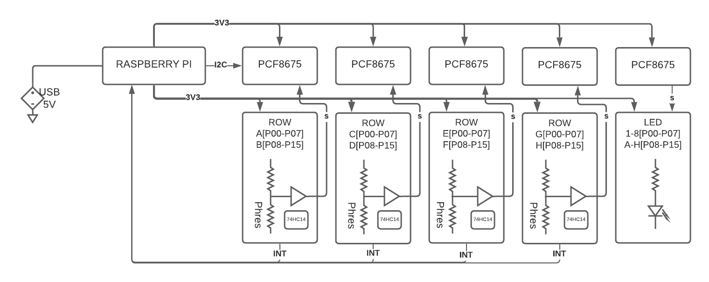

### Concept ###

Wishing to create a chess compter which is not dependent on push switches or special chess pieces with magnets and stuff like that, so the chess board is based on photoresistors as sensors, which of course will depend on the environment light, but most chess pieces should work with the board.

### Dependencies and installations

Enable I2C in $ sudo raspi-config

apt-get install -y libffi-dev smbus-cffi python3-venv

Use a virtual environment:

cd src/
python3 -m venv venv

source ../src/venv/bin/activate
